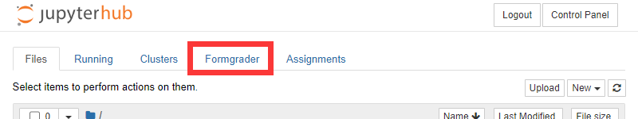
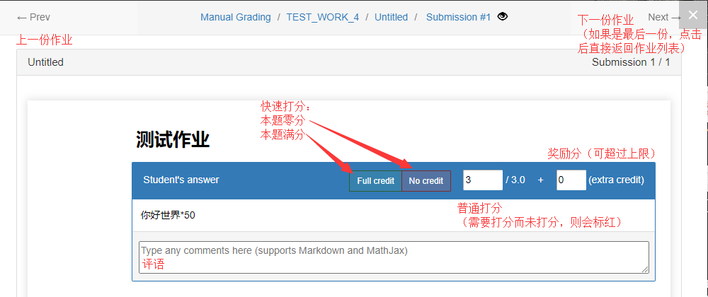

# JupyterHub&Nbgrader部署使用备忘录

## 事前检查

* JupyterHub相当于Webshell，故此
  * 检查服务器安全补丁时效，确保无提权漏洞。
  * JupyterHub创建的用户不应视为可信用户，应重视原有用户的文件管理问题。
  * 尽量使用HTTPS协议进行部署。
  * 若以上任意一点难以实现，应使用Docker或KVM部署JupyterHub。

* 其他的支持组件应有
  * HTTP服务器：用于提供反向代理，使用虚拟机时应部署于宿主机而非虚拟机。
  * HTTP服务器模块：以Apache2为例

    ```bash
    a2enmod ssl rewrite proxy proxy_http proxy_wstunnel
    ```

  * HTTP服务器配置见Install章节

* **不应**使用Conda安装nbgrader，目前（2020-2-12）使用Conda安装JupyterHub（1.1）+Nbgrader（0.6）时会出现多种错误，包括但不限于部分用户无法保存notebook，无法使用网页创建assignment等。

## 安装

以Ubuntu 1804为例，请使用**非root**的**sudo用户**进行以下操作：
> 此用户将作为JupyterHub管理员，需要写入用户名的地方，以【CURRENT USER】指代

* 安装全局组件

  ```bash
  # Install Python3 and npm
  sudo apt-get install python3 python3-pip npm screen
  # Jupyterhub requires configurable-http-proxy
  sudo npm install -g configurable-http-proxy
  # Change Pypi mirror.
  sudo pip3 install pip -U
  pip3 config set global.index-url https://pypi.tuna.tsinghua.edu.cn/simple
  ```

* 安装

  ```bash
  # Install JupyterHub and nbgrader in virtualenv
  sudo pip3 install virtualenv
  cd ~
  virtualenv JupyterHub_venv
  source ~/JupyterHub_venv/bin/activate
  pip install jupyterhub==1.1.0 notebook==6.0.3 nbgrader==0.6.1
  ```

* 启用插件

  全局启用nbgrader，禁用教师端插件

  ```bash
  # Enable nbgrader
  sudo env PATH=$PATH jupyter nbextension install --sys-prefix --py nbgrader --overwrite
  sudo env PATH=$PATH jupyter nbextension enable --sys-prefix --py nbgrader
  sudo env PATH=$PATH jupyter serverextension enable --sys-prefix --py nbgrader
  # Disable Create Assignment
  sudo env PATH=$PATH jupyter nbextension disable --sys-prefix create_assignment/main
  # Disable Formgrader
  sudo env PATH=$PATH jupyter nbextension disable --sys-prefix formgrader/main --section=tree
  sudo env PATH=$PATH jupyter serverextension disable --sys-prefix nbgrader.server_extensions.formgrader
  # Disable Course List
  sudo env PATH=$PATH jupyter nbextension disable --sys-prefix course_list/main --section=tree
  sudo env PATH=$PATH jupyter serverextension disable --sys-prefix nbgrader.server_extensions.course_list
  ```

  为教师启用教师端插件（可打包为.sh以便为教师执行）

  ```bash
  # Enable Create Assignment
  jupyter nbextension enable --user create_assignment/main
  # Enable Formgrader
  jupyter nbextension enable --user formgrader/main --section=tree
  jupyter serverextension enable --user nbgrader.server_extensions.formgrader
  ```

* 创建Jupyter Hub配置文件

  ```bash
  mkdir ~/JupyterHub_StartDir
  vim ~/JupyterHub_StartDir/jupyterhub_config.py
  ```

  ```python
  # ~/JupyterHub_StartDir/jupyterhub_config.py
  c.JupyterHub.bind_url = 'http://:8000/jupyter'
  c.Authenticator.admin_users = {'【CURRENT USER】'}
  c.LocalAuthenticator.create_system_users = True
  ```

* Jupyter Hub访问测试

  ```bash
  # Start the server for testing
  cd ~/JupyterHub_StartDir
  sudo env PATH=$PATH jupyterhub --config=jupyterhub_config.py
  ```

  使用SSH将端口映射至本地，使用浏览器访问，以【CURRENT USER】的用户名和密码登录，查看是否存在问题。

* 创建nbgrader配置文件、交换目录、课程目录

  > 注：
  >> 配置文件：
  >> </br>全局配置文件：【Virtualenv Path】/etc/jupyter/nbgrader_config.py
  >> </br>个人配置文件：~/.jupyter/nbgrader_config.py
  > ---
  >> 交换目录：
  >> </br>每个课程一个交换目录，777权限，用于教师与学生间文件交换：
  >> </br>若此服务器提供单一课程，交换目录定义在全局配置文件。
  >> </br>若此服务器提供多个课程，交换目录定义在每个用户的个人配置文件。
  > ---
  >> 课程目录：
  >> </br>**仅教师需要课程目录的定义**，学生获取课程信息的渠道为交换目录。
  >> </br>课程目录不应有可被学生访问的权限等级，否则学生可自行修改分数
  >
  > 以下举例为服务器提供单一课程的情况。

  ```bash
  # Create Exchange Dir
  mkdir ~/Jupyter_Hub_Exchange
  chmod 777 ~/Jupyter_Hub_Exchange
  # Create Class Dir
  mkdir ~/【Class Name】
  chmod 750 ~/【Class Name】
  # Create Global Config
  vim ~/JupyterHub_venv/etc/jupyter/nbgrader_config.py
  # Create Teacher Config
  vim ~/.jupyter/nbgrader_config.py
  # Create Class Config
  vim ~/【Class Name】/nbgrader_config.py
  ```

  ```python
  # ~/JupyterHub_venv/etc/jupyter/nbgrader_config.py
  c = get_config()
  c.Exchange.root = "【Path To Your Home Dir】/Jupyter_Hub_Exchange"
  ```

  ```python
  # ~/.jupyter/nbgrader_config.py
  c = get_config()
  c.CourseDirectory.root = "【Path To Your Home Dir】/【Class Name】"
  ```

  ```python
  # ~/【Class Name】/nbgrader_config.py
  c = get_config()
  c.CourseDirectory.course_id = "【Class Name】"
  ```

* 使用Screen在后台启动JupyterHub服务

  ``` bash
  deactivate
  screen -S jupyterhub
  source ~/JupyterHub_venv/bin/activate
  cd ~/JupyterHub_StartDir
  sudo env PATH=$PATH jupyterhub --config=jupyterhub_config.py
  ```

* 配置反向代理

按照前端服务器情况自行配置，但需注意必须启动websocket映射，否则仅能登录，无法运行命令。

## Jupyter Hub使用

### 登录、注销、开关服务

> 第一次登录时使用之前安装中的用户名和密码登录，在配置过程中已经设置为Admin。
> </br>其他用户使用管理员提供的用户名和密码登录


登录后进入控制面板首页（退出时未关闭服务可能直接进入Notebook），可以在此开关自己的Notebook服务。


若服务已开启，点击"My Server"即可进入，后续操作与Jupyter Notebook相同。

### （仅管理员）JupyterHub管理

如果已经进入Notebook，点击按钮进入控制面板，否则直接下一步


点击按钮进入管理面板


管理面板详解


添加用户后，管理员必须在终端下使用passwd命令给用户添加密码，否则按默认安全设置无法登录。

### （仅教师）Nbgrader管理

点击按钮进入Nbgrader管理界面



作业管理：Manage Assignments


作业设计-发布-收集-打分的流程如下：

* 创建作业：点击页面底部的"Add new Assignment"
  * Name：作业名，同时也是包含作业的目录名，不可修改。
  * Due date：截止日期
  * Timezone: 截止日期的时区（例如我国+0800）

* 删除作业未提供网页接口，应通过命令行删除。
* 编写题目：点击Name一列的文件名可进入该作业路径，在该作业路径下的所有Notebook均视为本次作业的一部分。
  1. 创建一个新的Jupyter Notebook
  2. 在菜单栏找到Cell-Cell Toolbar-Create Assignment
    
  3. 打开Create Assignment后，单元格类型选项解锁，共计六种
      * "-"：对学生而言和自己创建的普通单元格相同。
      * "ReadOnly"：不可修改的普通单元格。
      * "Manually Graded Answer"：**手动打分**，学生可修改的单元格
        > 用于不便于自动评分的题目，包括主观题等。
      * "Manually Graded Task"：**手动打分**，学生不可修改的单元格。
        > 用于需要学生自建Cell解决的题目，单元格内仅写题目。
      * "Autograded Answer"：**不可打分**，学生可修改的单元格
        > 用于可以自动判分的编程题目，必须与Autograder Test结合使用。
      * "Autograder Test"：**自动打分**，学生不可修改的单元格
        > 用于Autograded Answer的打分，Test中若raise error则不给分，否则给满分。
  4. 关键字启用，常用关键字如下

      ```python
      "### BEGIN SOLUTION"
      "### END SOLUTION"
      # 用于Autograded Answer。
      # 两个关键字之间的代码在发放给学生的版本中会被删除。
      "### BEGIN HIDDEN TESTS"
      "### END HIDDEN TESTS"
      # 用于Autograder Test。
      # 两个关键字之间的代码在发放给学生的版本中会被删除。
      ```

  5. 使用以上单元格类型和关键字设计作业，示例如下
  
  **作业出完之后，请全部执行一遍检测答案正确性再保存并关闭Notebook。**

* 发布作业
  1. 点击对应作业的Generate按钮，生成给学生的版本。
  2. 点击对应作业的Preview按钮，检查给学生的版本是否与预想相符。
  3. 点击对应作业的Release按钮，将作业发布。
  4. 作业出现在学生的Released assignments列表中，作业发布完成。
sh
* 收集作业：每次点击Collect按钮会自动收集学生当前最新提交的作业并刷新提交数量（同一学生可多次提交，新的覆盖旧的）。
* 作业打分

  1. 若已有学生提交作业，可点击Submissions一列的数字进入提交本作业的学生列表。
  2. 尚未打分的学生会出现提示：needs autograding，点击对应学生的Autograde，等待一段时间后即完成自动打分（为所有学生一次性打分的接口仅可通过终端调用，参见nbgrader文档）
  
  3. 如果存在手动打分题目，或学生在上一次提交作业后进行了修改，会提示：needs manual grading，点击此学生的名称即可对其作业手动打分和写评语。
  
  4. 手动打分界面：
  
  5. 手动打分完成后，学生状态改为：graded。
  

* 作业批复

  1. 点击Generate Feedback，打分和评语将自动渲染为HTML。
  2. 点击Release Feedback，将打分和评语发布，以供学生获取。
  * 注：在作业管理列表可对提交作业的所有学生统一进行批复，在学生列表仅批复对应的学生。

* 分数统计：
  
  * 通过API或SQLITE实现的统计请参考nbgrader官方文档。
  * 在页面左侧“Manual Grading”菜单，可查看一次作业所有学生的分数。
  * 在页面左侧“Manage Students”菜单，可查看一名学生所有作业的分数。

### （仅学生）作业系统使用

  点击按钮进入作业系统界面

  

  

  1. 在Released assinment列表中察看老师留的作业。
  2. 点击Fetch接收作业。
  3. 接收到的作业进入Downloaded assinment列表。
  4. 点击作业名展开，一次作业可能有一道以上的题目。
  5. 点击题目名开始解答。
  6. 解答题目后，点击题目对应的Validate，可以自动检查该题目。
  7. 解答完本次作业所有题目后，点击作业对应的Submit，提交作业。如果需要修改，可以修改后重新点击Submit提交作业。
  8. 作业提交后进入Submitted assinment列表。
  9. 点击作业对应的Fetch Feedback接收打分。
  10. 点击对应的view feedback（因为作业可以修改后重新提交，前面的时间是交作业的时间，以便区分是哪一次交的）查看打分。
